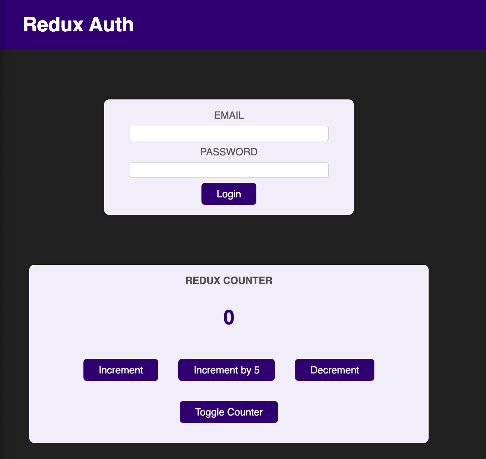
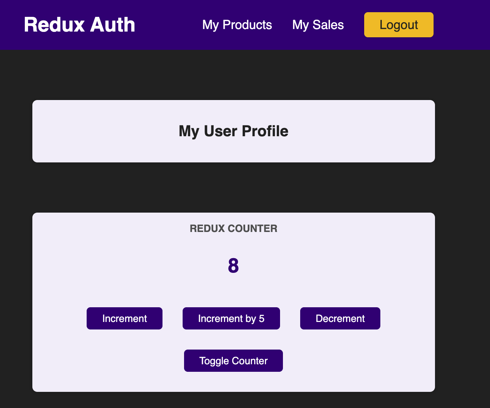
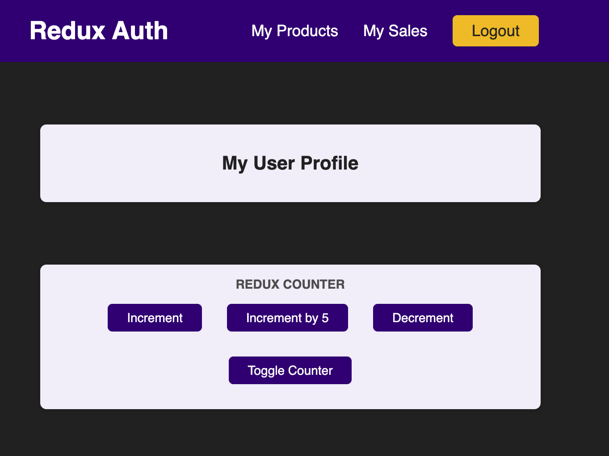

## redux-counter

Dependencies used are;
- react-redux
- redux
- reduxjs-toolit 


When you first run this project, you will see a screen like this.




The Login button on this page only checks whether the user is active or not.

```js
import {createSlice} from '@reduxjs/toolkit' 

const initialAuthState = {isAuthenticated:false,}
const authSlice = createSlice({
    name: 'authancation',
    initialState:initialAuthState,
    reducers:{
        login(state){
            state.isAuthenticated = true
        },
```

 The screenshot when clicking the login button will look like this.




There are 4 buttons in the Redux counter component located under the my user profile component.
- Increment : The increment button increases by 1.
- Increment by 5 : Increment by 5 increases the button by 5.
- Decrement : Decrement button decreases by 1.
- Toggle Counter : The Toggle Counter button hides the text showing the number when it is first clicked, and shows the hidden number text on the second click.


